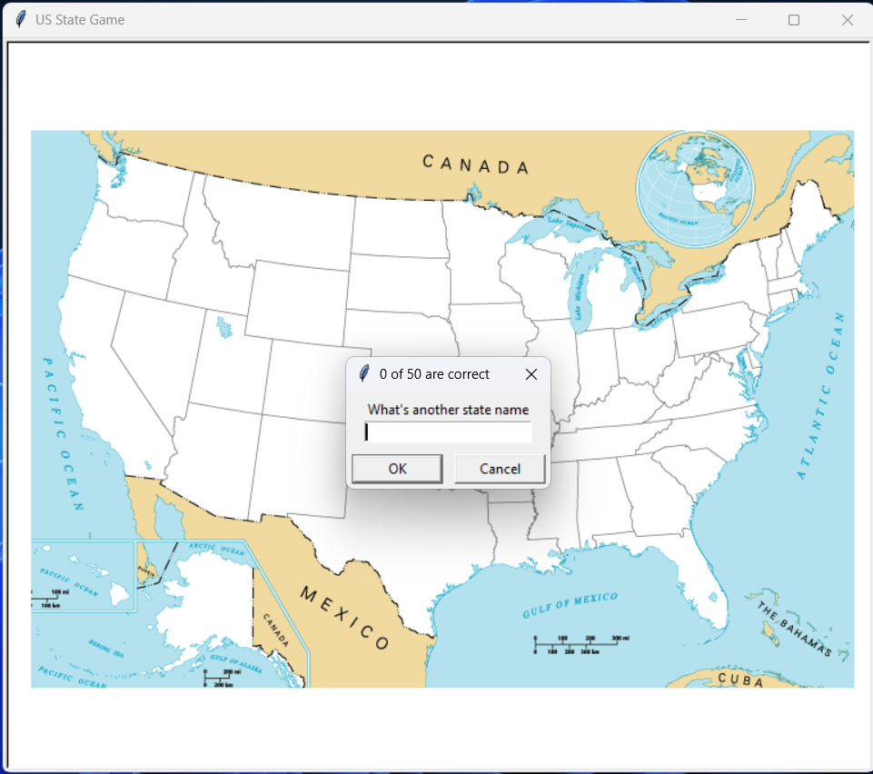

#  US State Game

A Python game where you try to guess all 50 US states.

## 🎮 How to Play

- The game displays a blank map of the United States.
- Enter the name of a US state in the input box.
- If your answer is correct, the state name appears on the map.
- Keep guessing until you find all 50 states.
- Type `Exit` to quit the game.

## 🛠️ Technologies

- Python
- Turtle
- Pandas

## 📁 Files

- `main.py` — Main game code
- `50_states.csv` — State names and coordinates
- `blank_states_img.gif` — Blank US map

## ▶️ Run the Game

Install Pandas:

```bash
pip install pandas

```
## 🎮 Game Screenshot

